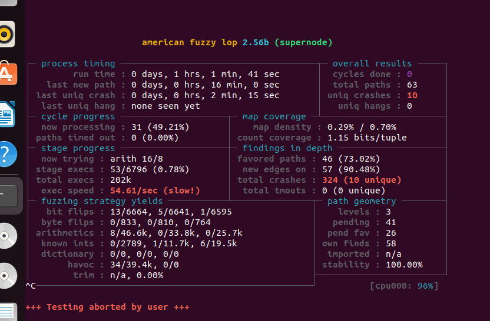
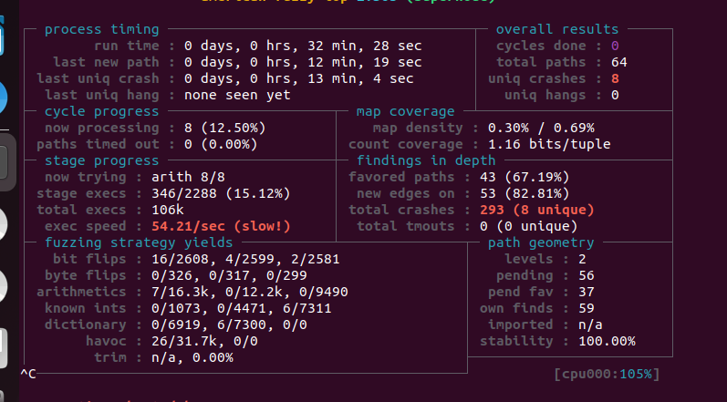
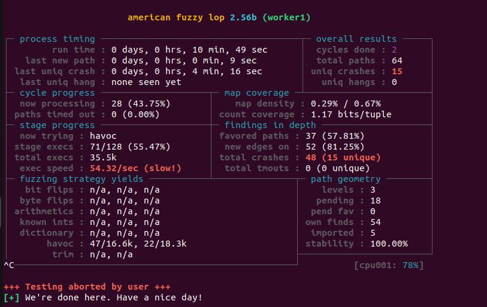
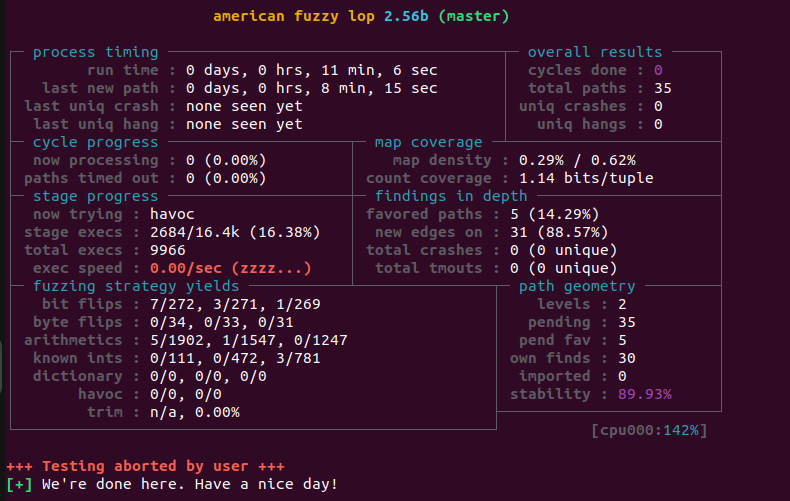

# Fuzzing the n2n Protocol with AFLNet

В этом репозитории собраны материалы, полученные в ходе выполнения работы по фаззингу сетевого протокола **n2n** с использованием **AFLNet**.


# Выбор проекта

В качестве объекта исследования был выбран проект **n2n**. Проект представляет собой реализацию peer-to-peer VPN, в которой взаимодействие между клиентами и супернодой осуществляется по собственному сетевому протоколу.

Выбор именно этого проекта был сделан, так как исходный код полностью написан на языке C, работа суперноды построена вокруг последовательного обмена сообщениями между участниками сети, поэтому логика обработки входящих пакетов зависит от текущего состояния соединения, а не только от содержимого одного сообщения. Это делает протокол подходящим кандидатом для stateful-фаззинга.

 Не удалось найти готовых примеров использования AFLNet или StateAFL.


# Выбор фаззера

Для выполнения работы был выбран AFLNet.

Обычный AFL предназначен для программ, которые получают входные данные из файлов, поэтому напрямую использовать его для тестирования сетевого сервера невозможно. AFLNet развивает идеи AFL и предназначен специально для фаззинга сетевых приложений. Вместо файлов он передает мутированные данные по сети.


# Подготовка проекта

Перед запуском фаззинга исходный код n2n пришлось немного изменить. Некоторые особенности поведения суперноды мешали корректной работе AFLNet, который многократно запускает исследуемое приложение, отслеживает покрытие кода и после каждого запуска вновь возвращает программу в исходное состояние.

Все изменения оформлены в виде отдельных патчей и находятся в каталоге `patches`.

## determinism.patch

Одним из требований greybox-фаззинга является воспроизводимость выполнения программы. Если один и тот же пакет несколько раз отправить серверу, программа должна проходить один и тот же путь выполнения. Только в этом случае AFLNet может определить, что изменение покрытия произошло именно из-за очередной мутации входных данных.

В исходной версии n2n использовалась случайная инициализация генератора псевдослучайных чисел и текущее системное время. Из-за этого одинаковые входные данные могли приводить к различному поведению программы.

Патч фиксирует начальное значение генератора случайных чисел и добавляет заглушку для функции `gettimeofday`.


## sigterm_handler.patch

Во время фаззинга AFLNet постоянно запускает и завершает исследуемый процесс. В исходной версии суперноды завершение происходило не всегда корректно, что могло приводить к появлению зависших процессов.


## gcov.patch

После завершения фаззинга требовалось получить отчет о покрытии кода.

Современные версии GCC используют функцию `__gcov_dump`, тогда как в старых версиях встречается вызов `__gcov_flush`. Патч заменяет устаревшую функцию на актуальную и выполняет ее только при сборке проекта с поддержкой покрытия через макрос `FUZZING_COVERAGE`.


# Сборка проекта

После применения всех патчей проект был собран с использованием компилятора `afl-clang-fast`.

В отличие от обычного `clang`, данный компилятор автоматически добавляет в исполняемый файл специальные точки контроля, позволяющие AFLNet определять, какие участки программы были выполнены после обработки каждого входного пакета.

Основная сборка выполнялась при помощи скрипта

   bash
./scripts/build_afl.sh


Для быстрой подготовки рабочего окружения использовался скрипт

   bash
./scripts/quickstart.sh


# Интеграция поддержки протокола в AFLNet

Одной из особенностей AFLNet является возможность учитывать состояние исследуемого протокола. Для этого фаззер должен понимать структуру сетевых сообщений и уметь извлекать из них информацию, необходимую для построения последовательностей запросов.

Для поддержки протокола n2n в исходный код AFLNet были добавлены пользовательские функции `extract_requests_n2n` и `extract_response_codes_n2n`. Первая отвечает за выделение отдельных запросов из входного потока данных, а вторая позволяет анализировать ответы исследуемого приложения и использовать их при исследовании различных состояний протокола.

Во время интеграции возникла проблема, не связанная непосредственно с самим n2n. После успешной компиляции AFLNet завершался практически сразу после запуска, выводя сообщение:

   text
Corrupted head alloc canary


Ошибка возникала внутри AFLNet.

После анализа исходного кода фаззера выяснилось, что AFLNet не использует стандартные функции работы с памятью. Вместо `malloc()` и `free()` он применяет собственный аллокатор `ck_alloc()`.

Все вызовы `malloc()`, относящиеся к реализованному парсеру протокола, были заменены на `ck_alloc()`.


# Подготовка начального корпуса

При фаззинге сетевых приложений использование полностью случайных пакетов оказывается малоэффективным. В большинстве случаев сервер отклоняет их еще на этапе проверки заголовков, поэтому исследуется лишь небольшая часть программы.

Чтобы избежать этой проблемы, был сформирован небольшой корпус корректных UDP-пакетов протокола n2n.
В стартовый корпус вошли:

пакеты регистрации узла `REGISTER_SUPER`, запросы информации о соседних узлах ,служебные heartbeat-сообщения.

Все файлы расположены в каталоге `seeds`.


# Пользовательский словарь

После подготовки стартового корпуса был создан пользовательский словарь AFLNet.

При его составлении был изучен исходный код n2n, содержащий описание структур сообщений и типов пакетов. На основании этого анализа были выделены наиболее часто используемые константы протокола, которые были добавлены в словарь.

Во время мутации AFLNet может использовать значения из словаря вместо полностью случайных байтов. Это позволяет значительно чаще формировать синтаксически корректные сообщения, успешно проходящие начальные проверки структуры пакета.

Для оценки эффективности словаря был проведен сравнительный эксперимент.

В первом случае фаззинг выполнялся только со стандартными мутациями AFLNet.



После этого аналогичный запуск был повторен с использованием пользовательского словаря.



Продолжительность запусков составляла около 30 минут и около 1 часа.

Полученные результаты показывают, что использование словаря позволяет быстрее исследовать новые пути выполнения программы.


# Многопроцессный фаззинг

AFLNet поддерживает запуск нескольких экземпляров фаззера одновременно. Все процессы используют общую директорию результатов и автоматически обмениваются найденными интересными входными данными. Такой режим позволяет эффективнее использовать вычислительные ресурсы и ускоряет исследование пространства состояний.

Главный экземпляр фаззера был запущен в режиме **master**.

   bash
./afl-fuzz \
-i ~/Desktop/n2n/seeds \
-o ~/Desktop/fuzzing_results/out_multi \
-N udp://127.0.0.1/7654 \
-P N2N \
-K \
-m none \
-t 10000+ \
-M master \
-- ~/Desktop/n2n/build_afl/supernode -p 7654 -f


Работа главного процесса показана ниже.



Одновременно был запущен второй экземпляр AFLNet в режиме **worker**.

   bash
./afl-fuzz \
-i ~/Desktop/n2n/seeds \
-o ~/Desktop/fuzzing_results/out_multi \
-N udp://127.0.0.1/7655 \
-P N2N \
-K \
-m none \
-t 10000+ \
-S worker1 \
-- ~/Desktop/n2n/build_afl/supernode -p 7655 -f


Результат работы второго процесса приведен на следующем скриншоте.



Во время работы процессы автоматически обменивались найденными тестовыми случаями.

На экране `worker1` можно увидеть поле

```text
imported : 5
```

Это означает, что процесс импортировал пять новых входных данных, найденных главным экземпляром AFLNet. После получения этих файлов фаззер продолжил их мутацию уже самостоятельно.


# Построение отчета о покрытии

Для этого использовалась стандартная возможность GCC — флаг `--coverage`, который автоматически добавляет в программу счетчики выполнения строк и переходов.

После сборки инструментированная версия суперноды была запущена повторно, а через нее был пропущен весь корпус тестовых данных, накопленный AFLNet в процессе фаззинга. 

На основе файлов gcov был сформирован отчет о покрытии.# Fuzzing the n2n Protocol with AFLNet

В этом репозитории собраны материалы, полученные в ходе выполнения работы по фаззингу сетевого протокола **n2n** с использованием **AFLNet**.


# Анализ найденных аварийных завершений

Во время многопроцессного фаззинга AFLNet зарегистрировал **15 аварийных завершений** исследуемой программы.

Первичный анализ показал, что найденные входные данные отличаются лишь отдельными мутациями и приводят к падению в одном и том же участке кода.

Причиной завершения программы является получение сигнала ,который возникает при обращении процесса к недопустимой области памяти.

Исследование входного пакета показало, что аварийное завершение вызывается сообщением типа `REGISTER_SUPER`.

Во время одной из мутаций AFLNet изменяет **41-й байт** полезной нагрузки пакета. Несмотря на повреждение структуры сообщения, супернода продолжает обработку полученных данных без достаточной проверки их корректности.


# Воспроизведение найденного крэша

Для удобства повторного воспроизведения найденной ошибки все необходимые материалы сохранены в каталоге

   text
docs/crashes/
   

Файл `crash_000_sigsegv.bin` представляет собой бинарный дамп UDP-пакета, вызывающего аварийное завершение программы.

В файле `README.md` приведен пример команды для повторной отправки сохраненного пакета с использованием вспомогательного скрипта.

```bash
python3 scripts/replay_seed.py \
docs/crashes/crash_000_sigsegv.bin \
127.0.0.1 \
7654
```

После запуска суперноды и отправки данного пакета воспроизводится найденное AFLNet аварийное завершение.

---

# Полученные результаты

Каталог `coverage_html` содержит HTML-отчет LCOV.

Каталог `crashes` включает пакет, воспроизводящий найденную ошибку, и инструкцию по его повторному запуску.

В каталоге `screenshots` находятся результаты сравнительного тестирования пользовательского словаря.

Файлы `master_fuzz.png` и `worker_fuzz.png` содержат скриншоты многопроцессного запуска AFLNet.


